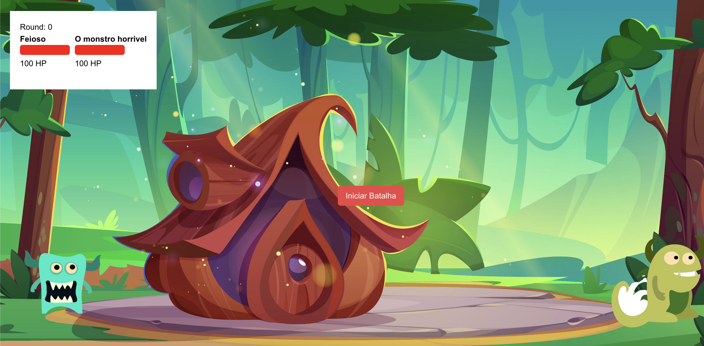

# Desafio técnico Revi

- O objetivo desse desafio é criar um algoritmo de batalha entre 2 monstros.
- O algoritmo deve ser implementado em TypeScript.

### Meu fluxo de desenvolvimento
 - Após receber o desafio, fiz a leitura do enunciado, para entender o que precisaria ser feito, li por volta de 3 vezes para entender o que é necessário.
 - Após fazer a leitura, comecei a escrever explicações sobre o que deveria ser feito, para garantir que eu tinha entendido o que precisaria ser feito.
 - Depois pensei em como seria para salvar os dados dos monstros, cheguei na ideia de usar o SQLite, mas como não era a hora ainda dessa decisão, eu deixei só como uma ideia no ar.
 - Depois de estar com a sensação de entendimento do que precisaria ser feito, comecei a escrever o algoritmo, em um arquivo chamado `teste-monstros.ts`. O objetivo aqui era de fato colocar a prova em código o que eu entendi na leitura e nos rabiscos.


 #### Primeira versão do algoritmo principal
 ```typescript
// Batalha entre 2 monstros
// Ver resultado ao fim da batalha

// Objeto monstro

class Monster {
    public hp = 100
    public damage = 0

    constructor(
        public name: string,
        public attack: number,
        public defense: number,
        public speed: number,
        public image_url?: string
    ) { }

    setupHp(hp: number) {
        this.hp = hp
    }
}

const feioso = new Monster(
    'feioso',
    10,
    15,
    10
)

const papao = new Monster(
    'papao',
    15,
    20,
    5
)

// Algoritmo de batalha
// O monstro com a maior velocidade faz o primeiro ataque; se ambdas as velocidades forem iguais, o monstro com o maior ataque vai primeiro.
// Para calcular o dano (damage), subtraia a defesa do ataque (atack - defense); a diferença é o dano; se o ataque for igual ou menor que a defesa, o dano é 1.
// Subtraia o dano do hp do monstro que sofreu o ataque (hp = hp - damage).
// Os monstros batalharão em rounds até que um vença; todos os rounds devem ser calculados de uma só vez.
// Quem vence a batalha é o monstro que substraiu o hp do inimigo a zero primeiro

class Batlle {
    public winner: Monster

    constructor(
        public leftMonster: Monster,
        public rightMonster: Monster
    ) {}

    public damageCalculator(attack, defense) {
        let damage = attack <= defense ? 1 : attack - defense

        return damage > 0 ? damage : 0
    }

    public start() {
        console.log('Starting battle')

        let battleFought = 1

        while (this.leftMonster.hp > 0 && this.rightMonster.hp > 0) {
            console.log(`Round ${battleFought}`)

            let damageRightMonster = this.damageCalculator(this.leftMonster.attack, this.rightMonster.defense)
            this.rightMonster.hp -= damageRightMonster
            console.log(`${this.leftMonster.name} ataca ${this.rightMonster.name} causando ${damageRightMonster} de dano. HP do ${this.rightMonster.name}: ${this.rightMonster.hp > 0 ? this.rightMonster.hp : 0}`);


            if (this.rightMonster.hp <= 0) {
                console.log(`${this.leftMonster.name} Venceu!!!`)
                break
            } 

            let damageLeftMonster = this.damageCalculator(this.rightMonster.attack, this.leftMonster.defense)
            this.leftMonster.hp -= damageLeftMonster
            console.log(`${this.rightMonster.name} ataca ${this.leftMonster.name} causando ${damageLeftMonster} de dano. HP do ${this.leftMonster.name}: ${this.leftMonster.hp > 0 ? this.leftMonster.hp : 0}`);

            if (this.leftMonster.hp <= 0) {
                console.log(`${this.rightMonster.name} Venceu!!!`)
                break
            } 

            battleFought++
        }
    }
}

const firstBattle = new Batlle(feioso, papao)
firstBattle.start()
 ```

 - Nesse momento ainda faltava as regras de quem inicia primeiro a batalha, mas isso foi feito posteriormente.
 - O código não tá muito organizado, mas isso não é o objetivo desse projeto.
 - Os comentários no código, são as regras descritas no documento do desafio, para facilitar a verificação do que o algoritmo deve fazer.

 #### Versão com regras de quem inicia a batalha
 ```typescript
 // Batalha entre 2 monstros
// Ver resultado ao fim da batalha

// Objeto monstro

class Monster {
    public hp = 100
    public damage = 0

    constructor(
        public name: string,
        public attack: number,
        public defense: number,
        public speed: number,
        public image_url?: string
    ) { }

    setupHp(hp: number) {
        this.hp = hp
    }
}

const feioso = new Monster(
    'feioso',
    20,
    20,
    5
)

const papao = new Monster(
    'papao',
    10,
    15,
    10
)

// Algoritmo de batalha
// O monstro com a maior velocidade faz o primeiro ataque; se ambdas as velocidades forem iguais, o monstro com o maior ataque vai primeiro.
// Para calcular o dano (damage), subtraia a defesa do ataque (atack - defense); a diferença é o dano; se o ataque for igual ou menor que a defesa, o dano é 1.
// Subtraia o dano do hp do monstro que sofreu o ataque (hp = hp - damage).
// Os monstros batalharão em rounds até que um vença; todos os rounds devem ser calculados de uma só vez.
// Quem vence a batalha é o monstro que substraiu o hp do inimigo a zero primeiro

class Batlle {
    public winner: Monster

    constructor(
        public leftMonster: Monster,
        public rightMonster: Monster
    ) {}

    private damageCalculator(attack, defense) {
        let damage = attack <= defense ? 1 : attack - defense

        return damage > 0 ? damage : 0
    }

    private attackMessage(attacker, defender, damage) {
        console.log(`${attacker.name} ataca ${defender.name} causando ${damage} de dano. HP do ${defender.name}: ${defender.hp > 0 ? defender.hp : 0}`)
    }

    public start() {
        console.log('Starting battle')

        let battleFought = 1

        while (this.leftMonster.hp > 0 && this.rightMonster.hp > 0) {
            console.log(`Round ${battleFought}`)

            let firstAttackMonster
            let secondAttackMonster

            // Se a velocidade for a mesma, o monstro com o maior ataque vai primeiro
            if (this.leftMonster.speed === this.rightMonster.speed) {
                if (this.leftMonster.attack > this.rightMonster.attack) {
                    firstAttackMonster = this.leftMonster
                    secondAttackMonster = this.rightMonster
                } else {
                    firstAttackMonster = this.rightMonster
                    secondAttackMonster = this.leftMonster
                }
            } else {
                if (this.leftMonster.speed > this.rightMonster.speed) {
                    firstAttackMonster = this.leftMonster
                    secondAttackMonster = this.rightMonster
                } else {
                    firstAttackMonster = this.rightMonster  
                    secondAttackMonster = this.leftMonster
                }
            }            

            let damageFirstAttackMonster = this.damageCalculator(firstAttackMonster.attack, secondAttackMonster.defense)
            secondAttackMonster.hp -= damageFirstAttackMonster
            this.attackMessage(firstAttackMonster, secondAttackMonster, damageFirstAttackMonster)

            if (secondAttackMonster.hp <= 0) {
                console.log(`${firstAttackMonster.name} Venceu!!!`)
                break
            } 

            if (firstAttackMonster.hp <= 0) {
                console.log(`${secondAttackMonster.name} Venceu!!!`)
                break
            } 

            let damageSecondAttackMonster = this.damageCalculator(secondAttackMonster.attack, firstAttackMonster.defense)
            firstAttackMonster.hp -= damageSecondAttackMonster
            this.attackMessage(secondAttackMonster, firstAttackMonster, damageSecondAttackMonster)
        
            if (secondAttackMonster.hp <= 0) {
                console.log(`${firstAttackMonster.name} Venceu!!!`)
                break
            } 
            
            if (firstAttackMonster.hp <= 0) {
                console.log(`${secondAttackMonster.name} Venceu!!!`)
                break
            } 
            
            battleFought++
        }
    }
}

const firstBattle = new Batlle(feioso, papao)
firstBattle.start()
 ```

##### Resultado 
```bash
Starting battle
Round 1
papao ataca feioso causando 1 de dano. HP do feioso: 99
feioso ataca papao causando 5 de dano. HP do papao: 95
Round 2
papao ataca feioso causando 1 de dano. HP do feioso: 98
feioso ataca papao causando 5 de dano. HP do papao: 90
Round 3
papao ataca feioso causando 1 de dano. HP do feioso: 97
feioso ataca papao causando 5 de dano. HP do papao: 85
Round 4
papao ataca feioso causando 1 de dano. HP do feioso: 96
feioso ataca papao causando 5 de dano. HP do papao: 80
Round 5
papao ataca feioso causando 1 de dano. HP do feioso: 95
feioso ataca papao causando 5 de dano. HP do papao: 75
Round 6
papao ataca feioso causando 1 de dano. HP do feioso: 94
feioso ataca papao causando 5 de dano. HP do papao: 70
Round 7
papao ataca feioso causando 1 de dano. HP do feioso: 93
feioso ataca papao causando 5 de dano. HP do papao: 65
Round 8
papao ataca feioso causando 1 de dano. HP do feioso: 92
feioso ataca papao causando 5 de dano. HP do papao: 60
Round 9
papao ataca feioso causando 1 de dano. HP do feioso: 91
feioso ataca papao causando 5 de dano. HP do papao: 55
Round 10
papao ataca feioso causando 1 de dano. HP do feioso: 90
feioso ataca papao causando 5 de dano. HP do papao: 50
Round 11
papao ataca feioso causando 1 de dano. HP do feioso: 89
feioso ataca papao causando 5 de dano. HP do papao: 45
Round 12
papao ataca feioso causando 1 de dano. HP do feioso: 88
feioso ataca papao causando 5 de dano. HP do papao: 40
Round 13
papao ataca feioso causando 1 de dano. HP do feioso: 87
feioso ataca papao causando 5 de dano. HP do papao: 35
Round 14
papao ataca feioso causando 1 de dano. HP do feioso: 86
feioso ataca papao causando 5 de dano. HP do papao: 30
Round 15
papao ataca feioso causando 1 de dano. HP do feioso: 85
feioso ataca papao causando 5 de dano. HP do papao: 25
Round 16
papao ataca feioso causando 1 de dano. HP do feioso: 84
feioso ataca papao causando 5 de dano. HP do papao: 20
Round 17
papao ataca feioso causando 1 de dano. HP do feioso: 83
feioso ataca papao causando 5 de dano. HP do papao: 15
Round 18
papao ataca feioso causando 1 de dano. HP do feioso: 82
feioso ataca papao causando 5 de dano. HP do papao: 10
Round 19
papao ataca feioso causando 1 de dano. HP do feioso: 81
feioso ataca papao causando 5 de dano. HP do papao: 5
Round 20
papao ataca feioso causando 1 de dano. HP do feioso: 80
feioso ataca papao causando 5 de dano. HP do papao: 0
feioso Venceu!!!
```


 - O código agora contempla as regras de quem inicia a batalha, e o resultado é o mesmo.
 - O código ficou maior e mais dificil de entender, antes de ir para o react, o código será refatorado para melhorar o entendimento, e entender se há algo errado com a logica do código.

 #### Refatorando o código
 ```typescript
 // Batalha entre 2 monstros
// Ver resultado ao fim da batalha

// Objeto monstro

class Monster {
    public hp = 100
    public damage = 0

    constructor(
        public name: string,
        public attack: number,
        public defense: number,
        public speed: number,
        public image_url?: string
    ) { }

    setupHp(hp: number) {
        this.hp = hp
    }
}

const feioso = new Monster(
    'feioso',
    20,
    20,
    5
)

const papao = new Monster(
    'papao',
    10,
    15,
    10
)

// Algoritmo de batalha
// O monstro com a maior velocidade faz o primeiro ataque; se ambdas as velocidades forem iguais, o monstro com o maior ataque vai primeiro.
// Para calcular o dano (damage), subtraia a defesa do ataque (atack - defense); a diferença é o dano; se o ataque for igual ou menor que a defesa, o dano é 1.
// Subtraia o dano do hp do monstro que sofreu o ataque (hp = hp - damage).
// Os monstros batalharão em rounds até que um vença; todos os rounds devem ser calculados de uma só vez.
// Quem vence a batalha é o monstro que substraiu o hp do inimigo a zero primeiro

class Batlle {
    public winner: Monster

    constructor(
        public leftMonster: Monster,
        public rightMonster: Monster
    ) {}

    private damageCalculator(attack, defense) {
        let damage = attack <= defense ? 1 : attack - defense

        return damage > 0 ? damage : 0
    }

    private attackMessage(attacker, defender, damage) {
        console.log(`${attacker.name} ataca ${defender.name} causando ${damage} de dano. HP do ${defender.name}: ${defender.hp > 0 ? defender.hp : 0}`)
    }

    private winnerMessage(winner) {
        console.log(`${winner.name} Venceu!!!`)
    }

    private attack(firstAttackMonster,secondAttackMonster) {
        let damageFirstAttackMonster = this.damageCalculator(firstAttackMonster.attack, secondAttackMonster.defense)
        secondAttackMonster.hp -= damageFirstAttackMonster
        this.attackMessage(firstAttackMonster, secondAttackMonster, damageFirstAttackMonster)

        if (secondAttackMonster.hp <= 0) {
            this.winnerMessage(firstAttackMonster)
        } 

        if (firstAttackMonster.hp <= 0) {
            this.winnerMessage(secondAttackMonster)
        } 
    }

    public start() {
        console.log('Starting battle')

        let battleFought = 1

        while (this.leftMonster.hp > 0 && this.rightMonster.hp > 0) {
            console.log(`Round ${battleFought}`)

            let firstAttackMonster
            let secondAttackMonster

            // Se a velocidade for a mesma, o monstro com o maior ataque vai primeiro
            if (this.leftMonster.speed === this.rightMonster.speed) {
                if (this.leftMonster.attack > this.rightMonster.attack) {
                    firstAttackMonster = this.leftMonster
                    secondAttackMonster = this.rightMonster
                } else {
                    firstAttackMonster = this.rightMonster
                    secondAttackMonster = this.leftMonster
                }
            } else {
                if (this.leftMonster.speed > this.rightMonster.speed) {
                    firstAttackMonster = this.leftMonster
                    secondAttackMonster = this.rightMonster
                } else {
                    firstAttackMonster = this.rightMonster  
                    secondAttackMonster = this.leftMonster
                }
            }            

            this.attack(firstAttackMonster, secondAttackMonster)

            this.attack(secondAttackMonster, firstAttackMonster)
            
            battleFought++
        }
    }
}

const firstBattle = new Batlle(feioso, papao)
firstBattle.start()
```

 - O código foi separado em metodos, para facilitar a leitura e entendimento e diminuir a quantidade de código.
 - Perceba que o método attack, agora tem dois parametros, o primeiro é o monstro que ataca, e o segundo é o monstro que recebe o dano.

```typescript 
    private attack(firstAttackMonster,secondAttackMonster) {
        const damageFirstAttackMonster = this.damageCalculator(firstAttackMonster.attack, secondAttackMonster.defense)

        this.removeHp(secondAttackMonster, damageFirstAttackMonster)

        this.attackMessage(firstAttackMonster, secondAttackMonster, damageFirstAttackMonster)

        if (secondAttackMonster.hp <= 0) {
            this.winnerMessage(firstAttackMonster)
        }

        if (firstAttackMonster.hp <= 0) {
            this.winnerMessage(secondAttackMonster)
        } 
    }
```

- Nesse trecho, como damageFirstAttackMonster nunca será alterado, transformei em const.
- Agora o método removeHp, recebe o monstro que sofreu o dano, e o dano que foi causado, e subtrai o hp do monstro. Isso facilita o entendimento do código.

```typescript
    let firstAttackMonster = this.leftMonster
    let secondAttackMonster = this.rightMonster

    // Se a velocidade for a mesma, o monstro com o maior ataque vai primeiro
    if (this.leftMonster.speed === this.rightMonster.speed) {
        if (this.rightMonster.attack > this.leftMonster.attack ) {
            firstAttackMonster = this.rightMonster
            secondAttackMonster = this.leftMonster
        }
    } else {
        if (this.rightMonster.speed > this.leftMonster.speed) {
            firstAttackMonster = this.rightMonster  
            secondAttackMonster = this.leftMonster
        }
    }   
```

 - Nesse trecho, apenas por iniciar as variaveis firstAttackMonster e secondAttackMonster, eu consigo diminuir a quantidade de estruturas condicionais, deixando o código mais legível.

```typescript
    private damageCalculator(attack: number, defense: number) {
        const defaultDamage = 1
        
        if (attack <= defense) {
            return defaultDamage
        }

        const damage = attack - defense

        return damage || 0
    }
```

 - O método damageCalculator, estava utilizando ternário, que a primeira analisada, fica um pouco dificil de entender a regra, mas agora ficou mais claro, eu acredito que numeros soltos não contam historias, por isso, o valor 1, agora está na constante defaultDamage.

 #### Última versão do algoritmo

 ```typescript
 // Batalha entre 2 monstros
// Ver resultado ao fim da batalha

class Monster {
    public hp = 100
    public damage = 0

    constructor(
        public name: string,
        public attack: number,
        public defense: number,
        public speed: number,
        public image_url?: string
    ) { }

    setupHp(hp: number) {
        this.hp = hp
    }
}

const feioso = new Monster(
    'feioso',
    20,
    20,
    5
)

const papao = new Monster(
    'papao',
    10,
    15,
    10
)

// Algoritmo de batalha
// O monstro com a maior velocidade faz o primeiro ataque; se ambdas as velocidades forem iguais, o monstro com o maior ataque vai primeiro.
// Para calcular o dano (damage), subtraia a defesa do ataque (atack - defense); a diferença é o dano; se o ataque for igual ou menor que a defesa, o dano é 1.
// Subtraia o dano do hp do monstro que sofreu o ataque (hp = hp - damage).
// Os monstros batalharão em rounds até que um vença; todos os rounds devem ser calculados de uma só vez.
// Quem vence a batalha é o monstro que substraiu o hp do inimigo a zero primeiro

class Batlle {
    public winner: Monster

    constructor(
        public leftMonster: Monster,
        public rightMonster: Monster
    ) {}

    private damageCalculator(attack: number, defense: number) {
        const defaultDamage = 1
        
        if (attack <= defense) {
            return defaultDamage
        }

        const damage = attack - defense

        return damage || 0
    }

    private attackMessage(attacker: Monster, defender: Monster, damage: number) {
        console.log(`${attacker.name} ataca ${defender.name} causando ${damage} de dano. HP do ${defender.name}: ${defender.hp > 0 ? defender.hp : 0}`)
    }

    private winnerMessage(winner: Monster) {
        console.log(`${winner.name} Venceu!!!`)
        this.winner = winner;
    }

    private removeHp(monster: Monster, damage: number) {
        monster.hp -= damage
    }

    private attack(firstAttackMonster: Monster, secondAttackMonster: Monster) {
        const damageFirstAttackMonster = this.damageCalculator(firstAttackMonster.attack, secondAttackMonster.defense)

        this.removeHp(secondAttackMonster, damageFirstAttackMonster)

        this.attackMessage(firstAttackMonster, secondAttackMonster, damageFirstAttackMonster)

        if (secondAttackMonster.hp <= 0) {
            this.winnerMessage(firstAttackMonster)
        }

        if (firstAttackMonster.hp <= 0) {
            this.winnerMessage(secondAttackMonster)
        } 
    }

    public fight() {
        console.log('Starting battle')

        let battleFought = 1

        while (this.leftMonster.hp > 0 && this.rightMonster.hp > 0) {
            console.log(`Round ${battleFought}`)

            let firstAttackMonster = this.leftMonster
            let secondAttackMonster = this.rightMonster

            // Se a velocidade for a mesma, o monstro com o maior ataque vai primeiro
            if (this.leftMonster.speed === this.rightMonster.speed) {
                if (this.rightMonster.attack > this.leftMonster.attack ) {
                    firstAttackMonster = this.rightMonster
                    secondAttackMonster = this.leftMonster
                }
            } else {
                if (this.rightMonster.speed > this.leftMonster.speed) {
                    firstAttackMonster = this.rightMonster  
                    secondAttackMonster = this.leftMonster
                }
            }            

            this.attack(firstAttackMonster, secondAttackMonster)

            this.attack(secondAttackMonster, firstAttackMonster)
            
            battleFought++
        }
    }

    public getWinner() {
        console.log(`Apresentando o ganhador: ${this.winner.name}!!!`)
    }
}

const firstBattle = new Batlle(feioso, papao)
firstBattle.fight()
firstBattle.getWinner()
 ```

#### Partindo para o React (Next.js)
Agora que o script de batalha está funcionando, posso ir para o alvo do desafio, o React. Onde vou adicionar a interface para o usuário adicionar os monstros, e também iniciar a batalha. 

 - Para salvar os dados dos monstros, eu utilizei o SQLite, que é uma base de dados muito simples, e que funciona bem com o React.
 - O primeiro passo foi a busca no ChatGpt para entender como configurar o SQLite, e como salvar os dados.
 - Vi que daria para facilitar a usabilidade do SQLite, utilizando o prisma, então segui com a instalação.
 - Depois de configurar o prisma, eu criei o esquema do banco de dados, e o modelo do monstro.
 - Após isso, fui até o site freepik.com, para encontrar imagens para os monstros, e salvei as imagens no meu projeto.
 - Com a imagens dos monstros e o fundo do cenário em mãos, eu criei 3 paginas, a home (Onde o jogar escolhe entre cadastrar monstros ou iniciar uma batalha), a monster (onde adiciona os monstros) e a arena (onde inicia a batalha).
 - O maior desafio e á arena, portando, por já saber a estrutura dos dados, eu iniciei por ela.
 - Na arena, ao abrir é carregado o menu de monstros, com a opção de escolher 2 monstros.
 - Ao escolher o último, a tela muda e fica cada mostro em um lado, bem como o board de informações de rouds e hp.
 - No botão ao centro, é possível iniciar a batalha, e a animação é bem simples, eles vão apenas se mover para frente e para tras, para simular o combate.
 - Ao finalizar, o ganhador aparece ao centro da tela com a mensagem "ganhador" e a opção para reiniciar.

 -- Fui atrás de entender, como eu iria movimentar o monstro a cada ataque, e como eu iria fazer a animação.
 -- Após configurar o básico de animação, comecei a inserir o algoritmo agora no react.

 #### Implementação no Next.js
 ```typescript
"use client"

import { Monster } from "@/utils/types/monster"
import { useEffect, useState } from "react"
import Battle from "./components/battle"
import styles from "./arena.module.css"
import { Winner } from "./components/winner"
import Menu from "./components/menu"
import { Board } from "./components/board"

export default function Arena() {
  const [rounds, setRounds] = useState(0)
  const [winner, setWinner] = useState<Monster | null>(null)
  const [isBattleStarted, setIsBattleStarted] = useState(false)
  const [leftMonster, setLeftMonster] = useState<Monster | null>(null)
  const [rightMonster, setRightMonster] = useState<Monster | null>(null)

  const leftAttack = () => {
    if (leftMonster && rightMonster) {
      const damage = leftMonster.attack <= rightMonster.defense ? 1 : leftMonster.attack - rightMonster.defense

      setRightMonster(prev => prev ? { ...prev, is_attacking: !rightMonster.is_attacking, hp: prev.hp - damage } : null)
      setLeftMonster(prev => prev ? { ...prev, is_attacking: !leftMonster.is_attacking } : null)
    }
  }

  const rightAttack = () => {
    if (leftMonster && rightMonster) {
      const damageRight = rightMonster.attack <= leftMonster.defense ? 1 : rightMonster.attack - leftMonster.defense

      setLeftMonster(prev => prev ? { ...prev, is_attacking: !leftMonster.is_attacking, hp: prev.hp - damageRight } : null)
      setRightMonster(prev => prev ? { ...prev, is_attacking: !rightMonster.is_attacking } : null)
    }
  }

  const battle = () => {
    if (leftMonster && rightMonster && leftMonster.hp > 0 && rightMonster.hp > 0) {
      const timeoutId = setTimeout(() => {
        if (leftMonster.speed > rightMonster.speed || (leftMonster.speed === rightMonster.speed && leftMonster.attack > rightMonster.attack)) {
          leftAttack()
          rightAttack()
        } else {
          rightAttack()
          leftAttack()
        }

        setRounds(prev => prev + 1)
      }, 1000)

      return () => clearTimeout(timeoutId)
    }
  }

  useEffect(() => {
    if (leftMonster && rightMonster) {
      if (leftMonster.hp <= 0) {
        setWinner(rightMonster)
      } else if (rightMonster.hp <= 0) {
        setWinner(leftMonster)
      } else if (isBattleStarted && leftMonster.hp > 0 && rightMonster.hp > 0) {
        const battleInterval = battle()
        return battleInterval
      }
    }
  }, [isBattleStarted, leftMonster?.hp, rightMonster?.hp])

  const fight = () => {
    setIsBattleStarted(true)
    setRounds(0)
    setWinner(null)
  }

  const handleSelect = (monster: Monster) => {
    if (!leftMonster) {
      setLeftMonster(monster)
    } else if (!rightMonster) {
      setRightMonster(monster)
    }
  }

  return (
    <div className={styles.bgArena}>
      {
        !leftMonster || !rightMonster ? (
          <Menu 
            onSelect={handleSelect} 
            leftMonster={leftMonster}
            rightMonster={rightMonster}
          />
        ) : ""
      }

      {
        leftMonster && rightMonster && !winner?.name && (
          <>
            <Battle 
              leftMonster={leftMonster}
              rightMonster={rightMonster}
            />
            <Board 
              leftMonster={leftMonster}
              rightMonster={rightMonster}
              rounds={rounds}
            />
            {
              !isBattleStarted && (
                <div className={styles.startButtonArea}>
                  <button className="bg-red-500 text-white px-4 py-2 rounded-md hover:bg-red-600" onClick={fight}>Iniciar Batalha</button>
                </div>
              )
            }
          </>
        )
      }
  
      {
        winner && <Winner winner={winner} />
      }
    </div>
  )
}
 ```

 - No lugar do while, o useEffect agora faz o papel de gerenciar o loop dos rounds.
 - Também utilizei a variavel is_attacking para controlar a animação básica dos monstros.
 - A variável isBattleStarted é usada para controlar se o jogo está ou não em andamento.
 - Ao final da batalha o vencedor é apresentado na tela.
 - Componentes auxiliares foram criados para diminuir o código no arquivo arena.tsx.

 #### Final
 - A criação do algoritmo em typescript, não foram utilizados, mas foi importante para o entendimento do que precisaria ser feito. 
 - O desafio maior foi controlar o loop de rounds para que atualizasse a tela com a simples animação, o hp e os rounds.
 

Obrigado pela oportunidade de participar do desafio!
